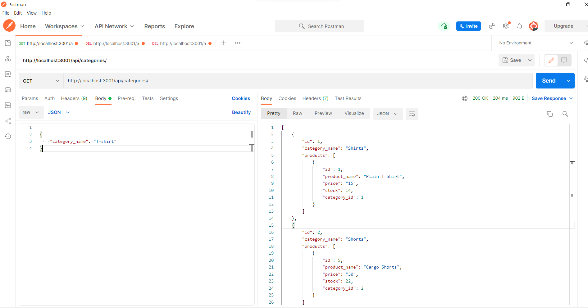
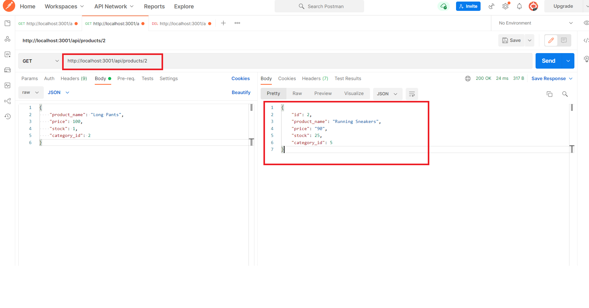
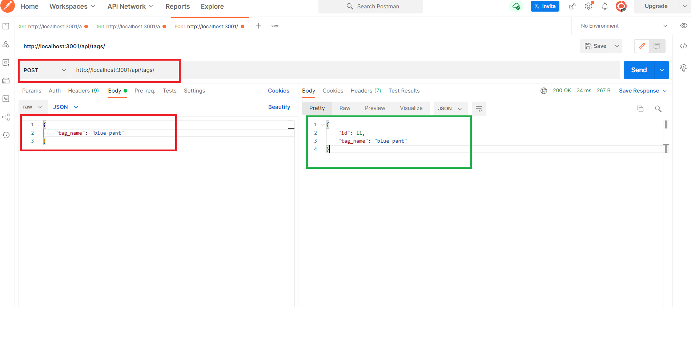
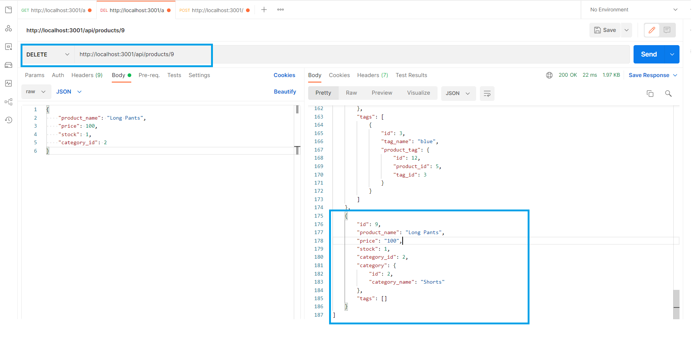
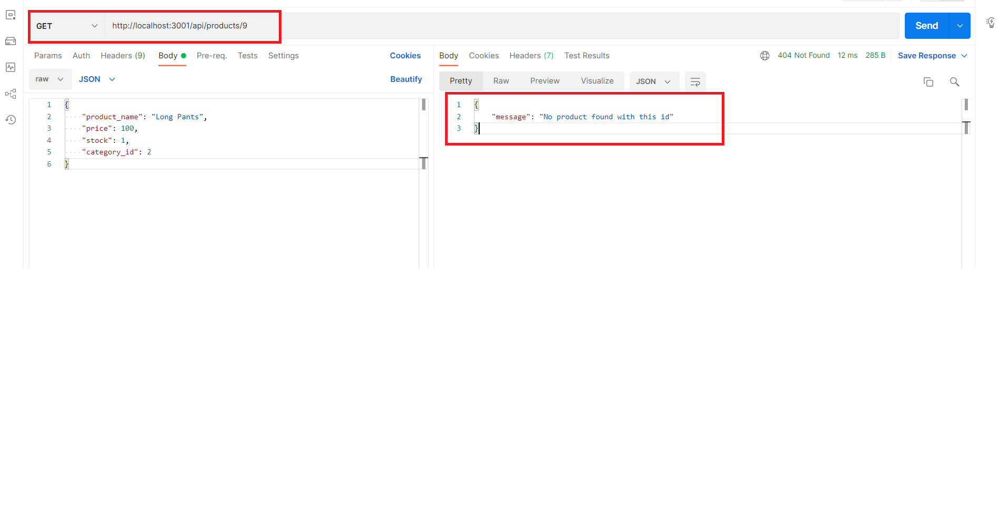

<h1 align="center">🛒 E-Commerce - Backend</h1>

---

# Description

This is a RESTful CRUD backend implementation of an __E-Commerce__ application that is built on an ORM design pattern. It consist of tables; 
* product name
* category name
* tag name

# Table of Contents

[Installation](#installation)

[Usage](#usage)

[Technologies](#technologies)

[Contribution](#contribution)

[Tests](#test)

[Questions](#questions)

[License](#license)

# Installation

1. First have Node.js installed
2. clone the repo and in your terminal type `git clone https://github.com/SophoanMeas/e-commerce-backend`
3. type `npm i` to install all the node dependencies for this project
4. type `npm start` to start the server in the background

5. Use backend testing tool such as `Insomnia` or `Postman` to test the different end-points `GET, POST, PUT, DELETE` 

# Usage

### Walkthrough Videos 🎥🎥

* <a href="https://note-taker-pon.herokuapp.com/" target="_blank"><h4>e-commerce back-end *Full Demo Video*</a>
    * <a href="https://note-taker-pon.herokuapp.com/" target="_blank"><h4> How to create a schema</a>
    * <a href="https://note-taker-pon.herokuapp.com/" target="_blank"><h4> How to seed the database</a>
    * <a href="https://note-taker-pon.herokuapp.com/" target="_blank"><h4> How to start the application</a>
    * <a href="https://note-taker-pon.herokuapp.com/" target="_blank"><h4> GET, PUT, POST, and DELETE Request</a>

# Technologies
Node Package Manager
* express.js
* sequelize
* mysql2
* dotenv

Back-end Testing Tools
* Insomia/Postman

# Contribution

N/A

# Test

N/A

# Questions

---

<h1 align="center">Contact Me</h1>

Check out my Github for more projects

Have a question? Feel free to drop me an email.

📧[sophoan.meas@hotmail.com](mailto:sophoan.meas@hotmail.com)

---

# License

#### Copyright© [sophoanMeas](https://github.com/sophoanMeas). All rights reserved.
#### Licensed under *GNU*

---

## Screenshot

* a screenshot of a GET request for all the category names

* a screenshot of a GET request for one product name

* a screenshot of a POST request for a tag name

* Fig. A, screenshot of a DELETE request of product name
    * when the request is send the item is deleted from the database shown in fig. B

fig. A

fig. B
